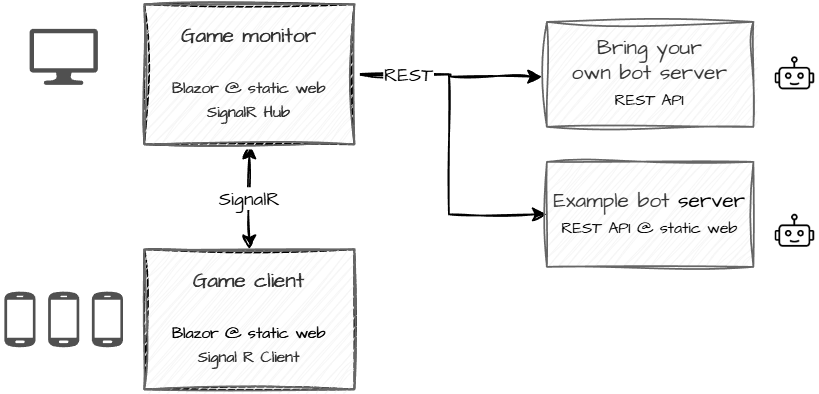
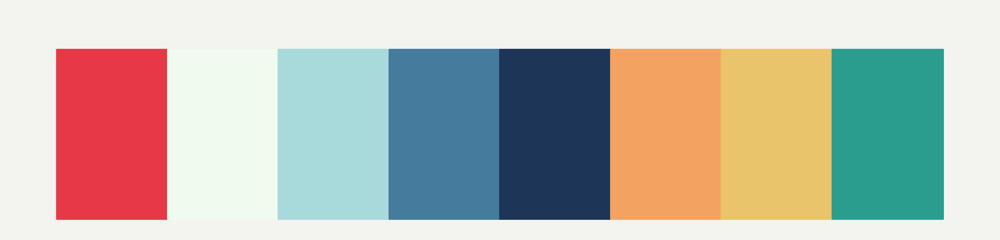

# Mexican Standoff

A quick mind game, implemented with Blazor and SignalR.

## Components




### Deployment

Deploy as a .NET Blazor app, e.g. as an Azure Web App.

**azure-webapps-dotnet-core.yml**

The GitHub workflow defined
[`.github/workflows/azure-webapps-dotnet-core.yml`](.github/workflows/azure-webapps-dotnet-core.yml)
will build and deploy the app to Azure.

**NOTE:** In a GitHub repo, set secrets and variables:
- `env.AZURE_WEBAPP_NAME`: Name of the Azure Web App
- `secrets.AZURE_WEBAPP_PUBLISH_PROFILE`: Publish profile of the Azure Web App

## Tailwind

Locally, on Prebuild, we run `npm run build:css`, but to continually build base.css, use

```sh
npm run watch:css
```
Inspired by:
https://steven-giesel.com/blogPost/364c43d2-b31e-4377-8001-ac75ce78cdc6

---
[Tailwind CLI](https://tailwindcss.com/docs/installation/tailwind-cli)
```sh
npm install tailwindcss @tailwindcss/cli
```

## Color scheme for characters

- Red: #E63946
- Off-white: #F1FAEE
- Light Blue: #A8DADC
- Medium Blue: #457B9D
- Dark Blue: #1D3557
- Orange: #F4A261
- Yellow: #E9C46A
- Teal: #2A9D8F

## TODO items

- support for bring your own bot + example bots
- Support for giving up => QUIT state on Player
	- Signal to server
	- Recalculate game state
- Countdown time

### Play.razor

- Navigation
	- Some back button or Home link when
		- Waiting for players
		- In game as well
- Game ended
	- If winner:  Sound. Else other sound
	- If game with same id exists
		- reload the game
		- Offer to rejoin
- Maybe: support for switching to game state view
- After QUIT (to start page), offer rejoin
	- Maybe save played games in local storage? Or in memory?
	- List games in State Created
- Support for removing input name from local storage to get new suggestion
	- Or just support for suggestion
- Maybe keep character id in local storage
- Optimization
	- With app.MapStaticAssets gone, use smaller images

### PlayMonitor.razor

- Navigation
	- Some back button or Home link when
		- Waiting for other players
		- In game as well?
		- When game has ended, anyway
- Responsive layout: support for phone
	- Maybe alternative:
		- Use no monitor
		- All players can switch to game state on their device
- Kick player: Add confirm
- Maybe "Fix" button
	- Would try to resolve things
		- Trigger bots again, if there is no selected card
		- etc