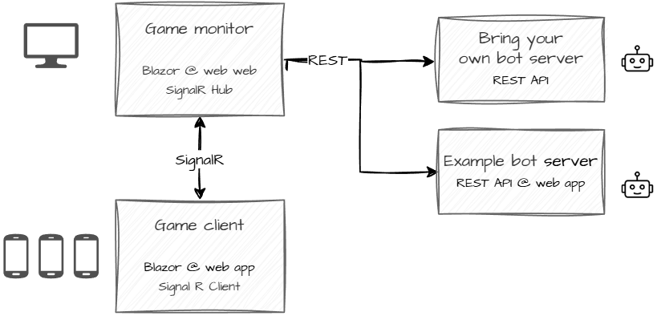

# Mexican Standoff

A quick mind game, implemented with Blazor and SignalR.

## Components




### Deployment

To keep the cost low, a good option is to use an Azure Static Web App for deployment.

But as a .NET Blazor app, it can be deployed anywhere you like.

## Tailwind

On Prebuild, we run `npm run build:css`, but to continually build base.css, use

```sh
npm run watch:css
```

Inspired by:
https://steven-giesel.com/blogPost/364c43d2-b31e-4377-8001-ac75ce78cdc6

## TODO items

- Change CHEST: Only one chest, but multiple can get coin if many players
- github actions
- parameterize pipeline yaml file
- support for bots
- example bots
- Use SignalR hub instead of EventHandlers
- Player names
- Player select color
- Support for giving up

## TODO urgent

### Play.razor
- Keep playable cards from the round that is being revealed
	- Maybe hide cards + show spinner?
- Sounds: Only first Join sound is played
- Game ended
	- Show after reveal
	- If game with same id exists
		- reload the game
		- Offer to rejoin
- Flicker
	- player or game is null for a little while
- Select own name
	- Maybe offer suggestion + set own
	- Check availability in game
- Layout cards
	- Long player names looks ugly (Henchman boggs)
- Maybe: switch to game state
- After QUIT, offer rejoin
	- Maybe save played games in local storage? Or in memory?
	- List games in State Created

### PlayMonitor.razor

- BUG: Too many joins a game; 4 instead of 3, e.g.
- Response layout: support for phone
	- Maybe alternative:
		- Use no monitor
		- All players can switch to game state on their device
- Game ended
	- Show after reveal
		- "Round 2  - game over"
		- "Back to start" button
- Flicker
	- game is null for a little while
- Sounds at reveal
- Kick player